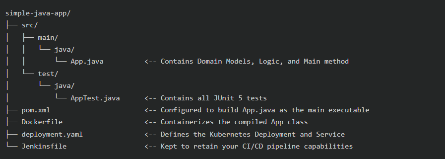

Online Grocery Delivery System 

The Core Problem We Solved
- Running an online grocery store involves severe logistical challenges.
- Sending out a delivery driver for a single $2 item costs more than the item itself.
- Double-booking the exact same delivery slot for two different customers causes massive delays and frustration.

Our Proposed Solution
- We built a custom Java engine that acts as a strict gatekeeper for the business.
- Rule 1: It automatically rejects any order that doesn't meet a $10 minimum.
- Rule 2: It mathematically checks and blocks any attempt to double-book a delivery slot.
- We then wrapped these rules into a fully automated Continuous Integration (CI/CD) pipeline.
- Now, whenever a developer updates the code, an automated system (Jenkins) strictly tests it, packages it safely into a Docker container, and deploys it live to our Kubernetes cluster.
- This guarantees 100% human-error-free updates to the live site.

Architecture Overview: A Simple Journey
- The Logic (Java): Developers write the core business rules and verify them locally using Maven.
- The Cloud Vault (GitHub): Verified code is pushed up to our central Git repository for safekeeping.
- The Automated Brain (Jenkins): Jenkins constantly watches GitHub, immediately pulling down new code and running JUnit tests to guarantee it works.
- The Shipping Container (Docker): Passing code is sealed inside a lightweight, portable Docker container so it runs flawlessly anywhere.
- The Manager (Kubernetes): The container is handed to Kubernetes, which acts as the orchestrator to keep multiple copies of the app healthy and alive on the internet.

Project Structure

- src/main/java/App.java: The core application containing our data models and validation rules.
- src/test/java/AppTest.java: The automated JUnit test suite that proves our logic is secure.
- pom.xml: The Maven file managing our compilation process and testing plugins.
- Jenkinsfile: The pipeline script telling Jenkins exactly how to automate our deployment.
- Dockerfile: Instructions for containerizing our compiled Java application.
- deployment.yaml: The orchestration file instructing Kubernetes on how to manage our live app.

How to Build and Run Locally
- To run the tests and prove everything works safely: mvn clean test
- To compile the Java code into an executable package: mvn package
- To deploy the latest container to your cluster: kubectl apply -f deployment.yaml

Adapting to New Scenarios
- You never need to touch the DevOps files (Jenkins, Docker, Kubernetes) when business rules change.
- Simply swap out the Java objects in App.java (e.g., change an Order to a DigitalWallet).
- Write a few quick true/false tests in AppTest.java to prove the new logic works.
- Push your code to GitHub, and Jenkins will automatically test and deploy your new scenario.

Future Enhancements
- Connect a PostgreSQL database to permanently store order histories and customer profiles.
- Build a front-end UI allowing customers to intuitively interact with the engine through a browser.
- Implement an email notification service that alerts customers the second a delivery slot is confirmed.
- Introduce an isolated testing environment in Kubernetes to double-check the app before it reaches actual customers.

Conclusion
In the end, this project was primarily built to understand how business logic and DevOps pipelines work together. By separating the rules (the Java code) from the infrastructure (Jenkins and Kubernetes), we created a system that is incredibly easy to test, update, and deploy. The code does exactly what it needs to do—preventing bad orders and double-booked deliveries—while the automated robots handle the heavy lifting of getting it onto the internet.

Outsourced From ChatGPT 
